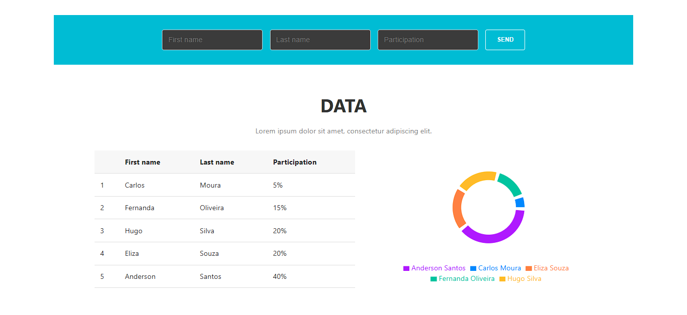

# Desafio Fullstack

Este é um projeto fullstack que exibe uma tabela e um gráfico de participação em formato de pizza, com um formulário para adicionar novos dados. Desenvolvido como um desafio técnico da empresa Cotabox.

---

### Layout da Aplicação



---

### Features

* **Front-end:** Interface reativa construída com React para exibir os dados.
* **Back-end:** API RESTful construída com Node.js e Express.
* **Banco de Dados:** Persistência de dados com MongoDB.
* **Visualização de Dados:** Tabela e Gráfico de Rosca para representar a participação.
* **Validação:** Validação de dados tanto no cliente quanto no servidor.

---

### Tecnologias Utilizadas

* **Front-end:** React, Vite, Axios, Recharts
* **Back-end:** Node.js, Express, Mongoose, Dotenv, Cors
* **Banco de Dados:** MongoDB Atlas

---

### Como Rodar o Projeto Localmente

Siga os passos abaixo para executar o projeto em sua máquina.

**Pré-requisitos:**
* [Node.js](https://nodejs.org/en/) (versão 16 ou superior)
* [Git](https://git-scm.com/)

**1. Clone o Repositório**
```bash
git clone [https://github.com/seu-usuario/nome-do-repositorio.git](https://github.com/seu-usuario/nome-do-repositorio.git)
cd nome-do-repositorio
```

**2. Configuração do Back-end**
```bash
#Navegue até a pasta do back-end
cd backend

#Instale as dependências
npm install

#Crie um arquivo .env a partir do exemplo
#(No Windows, use 'copy' em vez de 'cp')
cp .env.example .env

#Abra o arquivo .env e adicione sua string de conexão do MongoDB Atlas
#Ex: MONGO_URI=mongodb+srv://...

#Inicie o servidor do back-end
npm run dev
#O servidor estará rodando em http://localhost:5000
```

**3. Configuração do Front-end**
```bash
#Em um NOVO terminal, navegue até a pasta do front-end
cd frontend

#Instale as dependências
npm install

#Inicie a aplicação React
npm run dev
#A aplicação estará disponível em http://localhost:5173 (ou outra porta indicada)
```

Pronto! Agora você pode acessar a aplicação no seu navegador.

---

### 🔗 Endpoints da API

* `GET /api/participants`: Retorna todos os participantes.
* `POST /api/participants`: Cria um novo participante.
    * Corpo da requisição: `{ "firstName": "string", "lastName": "string", "participation": number }`